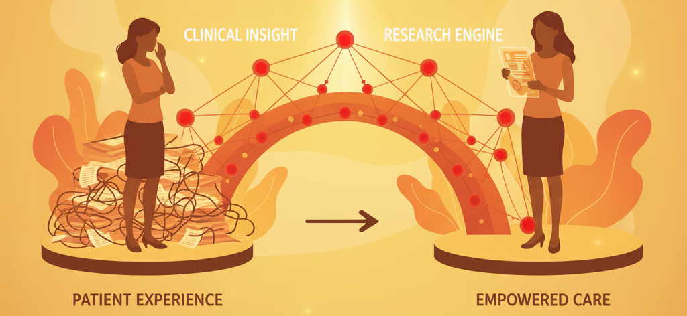

# **LUCIA: Language Understanding for Clinical Insight & Analysis**

**A Collaborative Clinical Instrument | Built with Google ADK & Gemini**

LUCIA is an AI-powered scientific instrument designed to bridge the gap between patient narratives and clinical data. It analyzes medical research to surface and mitigate diagnostic bias in women's health.

Designed as a **"bridge, not a wedge,"** LUCIA serves two distinct masters:

* **The Clinician (Efficiency & Safety):** Acts as an intelligent "pre-screener," synthesizing complex narratives into structured clinical data (Review of Systems) to reduce cognitive load and burnout.
* **The Researcher (Discovery & Equity):** Utilizes the "AXIOM Engine" concept to flag systemic bias in literature and collect real-world evidence to fill medical "Data Voids."

## **📚 Table of Contents**

1. [Architecture & Workflow](https://www.google.com/search?q=%231-architecture--workflow-the-dual-stream-engine)
2. [Project Structure](https://www.google.com/search?q=%232-project-structure) 
3. [Installation & Setup](https://www.google.com/search?q=%233-installation--setup) 
4. [Usage & Testing](https://www.google.com/search?q=%234-usage--testing) 
5. [Demo Scenario](https://www.google.com/search?q=%235-demo-scenario-the-perimenopause-dismissal) 
6. [Cloud Deployment](https://www.google.com/search?q=%236-cloud-deployment-vertex-ai-agent-engine) 
7. [Future Vision](https://www.google.com/search?q=%237-future-vision)

## **1\. Architecture & Workflow ("The Dual-Stream Engine")**

LUCIA utilizes a **Multi-Agent Orchestration** built on the Google Agent Development Kit (ADK). The system processes the patient's subjective narrative through four distinct stages to create a structured clinical asset.

### **Why Agents?**

* **Specialization:** Distinct roles (Symptom Mapper vs. Bias Analyzer) ensure rigorous separation between the patient's own thoughts and existing clinical assumptions. 
* **Statefulness:** A dynamic "Session State" evolves in real-time, updating symptoms and detected biases as the narrative unfolds. 
* **Verifiable Tool Use:** Agents trigger tools (e.g., get\_bias\_implications) to ground insights in peer-reviewed literature rather than relying solely on LLM training data.

### **The 4-Stage Pipeline**

1. **Ingest & Map (The Digital Scribe)** 
   * **Agent:** `symptom_mapper` 
   * **Action:** Ingests user narrative and translates emotional history into a structured Review of Systems (ROS). It updates the symptomMapping state (e.g., "brain fog" $\\to$ Neurological Cluster). 
2. **Audit (Clinical Decision Support)** 
   * **Agent:** `bias_analyzer` 
   * **Tool:** AXIOM Knowledge Base (via `get\_bias\_implications`) 
   * **Action:** Audits the narrative for cognitive traps like premature closure. It asynchronously updates biasAwareness, framing potential biases as diagnostic pivot points. 
3. **Advocacy (The Patient Prep Engine)** 
   * **Agent:** `advocacy_generator` 
   * **Action:** Transforms anxiety into a structured agenda. Generates structuredAdvocacy questions (e.g., "Given symptoms X and Y, should we check thyroid function?") to focus the conversation. 
4. **Structure (The Clinical Handoff)** 
   * **Agent:** `report_formatter` 
   * **Action:** Compiles the final output into a professional Consultation Brief (Subjective $\\to$ Assessment $\\to$ Plan).

## **2\. Project Structure**

lucia\_agent/  
├── images/                   \# Project assets (logos, diagrams)   
├── lucia\_deploy/             \# Deployment artifacts for Vertex AI Agent Engine  
│   ├── .agent\_engine\_config.json   
│   ├── agent.py              \# Deployment-specific agent logic   
│   ├── requirements.txt   
│   └── .env   
├── main\_agent/               \# Core application logic   
│   ├── \_\_init\_\_.py   
│   └── agent.py              \# Root Agent, Sub-agents, and Orchestration logic   
├── tests/                    \# Integration and Unit tests   
│   ├── README.md   
│   └── test\_agent.py         \# Main integration runner script   
├── .env                      \# Environment variables (Excluded from Git)   
├── requirements.txt          \# Python dependencies   
├── README.md                 \# Project documentation   
└── LICENSE  

## **3\. Installation & Setup**

### **Prerequisites**

* **Python 3.10+** (Required for Google ADK) 
* **Google Cloud Project** with **Gemini API** enabled. 
* **Google API Key**

### **Step 1: Clone and Environment**

`git clone \[https://github.com/innacampo/lucia_agent.git\](https://github.com/innacampo/lucia_agent.git)` 
`cd lucia agent` 

`\# Create a virtual environment` 
`python3 \-m venv venv` 

`\# Activate the virtual environment` 
`\# On macOS/Linux:` 
`source venv/bin/activate` 
`\# On Windows:` 
`.\\venv\\Scripts\\activate`

### **Step 2: Install Dependencies**

`pip install \-r requirements.txt`

### **Step 3: Configuration**

Create a .env file in the root directory. **Do not commit this file.**

`\# .env file` 
`GOOGLE\_API\_KEY="your\_actual\_api\_key\_here"` 
`LOG\_LEVEL=INFO`

## **4\. Usage & Testing**

We use a manual integration test script to verify the agent's behavior against specific patient narratives.

To run the integration test:

`python \-m tests.test\_agent`

## **5\. Demo Scenario: The "Perimenopause" Dismissal**

In this scenario, a 48-year-old user shares a frustrating interaction regarding autoimmune-like symptoms.

## Step 1: The Narrative (Input)  
*User:* "I've been waking up with stiff, swollen joints in my hands and feet for three months. The fatigue is so bad I have to nap in my car at lunch. I saw a new doctor today. I tried to show him the swelling, but he barely looked. He told me that at 48, this is just classic perimenopause and 'empty nest syndrome' making me depressed. He didn't order any blood work. He just told me to lose 10 pounds and try meditation to calm my 'nerves' because women get so anxious at this stage of life."

## Step 2: The Logic (Internal Monologue & Tool Usage)   
Agent 1 (`Symptom Mapper`): Extracts Symptoms and assigns them to clusters:
stiff joints in my hands and feet $\\to$ pain cluster
fatigue $\\to$ fatigue cluster
swollen joints in my hands and feet  $\\to$ musculoskeletal cluster
Agent 2 (`Bias Analyzer`): Detects bias markers in the narrative (attribution of physical swelling to 'nerves') and queries the AXIOM Knowledge Base.
Tool Call: `get_bias_implications(bias_type="ageism_bias")`
Output: "Dismissing a patient's medical concerns as a normal or inevitable part of aging. This can prevent the timely diagnosis and treatment of serious conditions like heart disease, cancer, or neurological issues."
Tool Call: `get_bias_implications(bias_type="gender_bias")`
Output: "Often results in women's pain being taken less seriously or misdiagnosed, particularly in cardiovascular and autoimmune diseases."
Agent 3 (`Advocacy generator`): Generates advocacy questions for the patient

## Step 3: The Output (Advocacy Report)  
LUCIA generates the following document for the patient:
**Patient Advocacy & Consultation Aid**

**Disclaimer:** This report is generated to assist in patient–doctor communication and is not medical advice. Always consult a qualified healthcare professional for diagnosis and treatment.

**1. Summary of Reported Symptoms:**
* Pain Cluster: stiff joints in my hands and feet
* Fatigue Cluster: fatigue
* Musculoskeletal Cluster: swollen joints in my hands and feet

**2. Communication & Bias Insights:**
* Ageism Bias
    * Observation: Doctor attributed joint swelling, stiffness, and fatigue to perimenopause and 'empty nest syndrome' at age 48 without ordering tests.
    * Potential Risk: Dismissing a patient's medical concerns as a normal or inevitable part of aging. This can prevent the timely diagnosis and treatment of serious conditions like heart disease, cancer, or neurological issues.
* Gender Bias
    * Observation: Doctor attributed symptoms to 'empty nest syndrome' and anxiety due to the patient's age and sex, and suggested weight loss and meditation instead of medical investigation.
    * Potential Risk: Often results in women's pain being taken less seriously or misdiagnosed, particularly in cardiovascular and autoimmune diseases.

**3. Suggested Questions for Your Doctor:**
* What further evaluations could help understand my stiff and swollen joints?
* Are there additional causes for my fatigue we should consider?
* Could we explore explanations for my symptoms beyond age-related changes?
* How can we ensure my symptoms are evaluated thoroughly, considering potential gender-related factors in diagnosis?

## **6\. Cloud Deployment (Vertex AI Agent Engine)**

The LUCIA agent has been deployed to Google Cloud's Vertex AI Agent Engine as a secure, serverless API.

* **Platform:** Vertex AI Agent Engine 
* **Region:** us-central1

### **Deploy Command**

To deploy the contents of the lucia\_deploy/ directory:

adk deploy agent\_engine \\
 
  \--project=$PROJECT\_ID \\
 
  \--region=$deployed\_region \\
 
  lucia\_deploy \\ 

  \--agent\_engine\_config\_file=lucia\_deploy/.agent\_engine\_config.json

## **7\. Future Vision**

This capstone demonstrates LUCIA's immediate utility, but its long-term value lies in longitudinal observation.

* **For Researchers:** Future iterations will allow women to donate anonymized data to AXIOM, creating the "Big Data" needed to update guidelines.
* **For Clinicians:** Provides a "longitudinal view" of a patient's journey, revealing cyclical patterns invisible in snapshot appointments.

 
